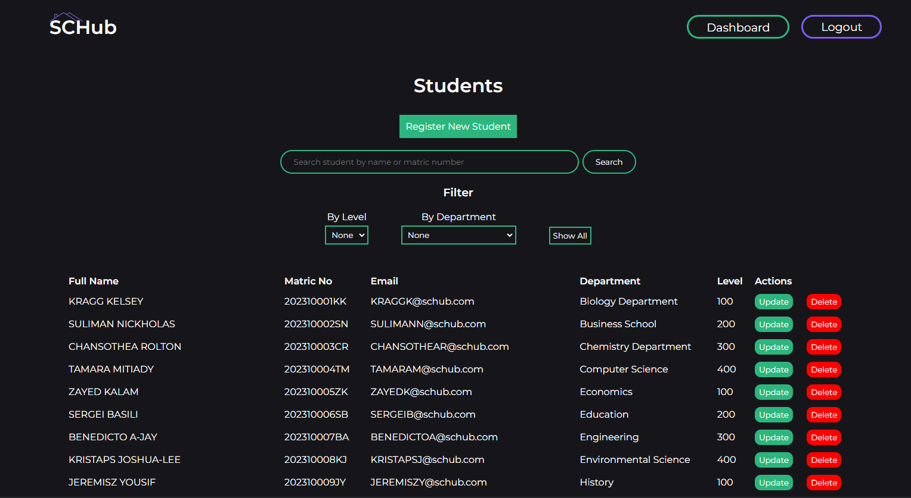
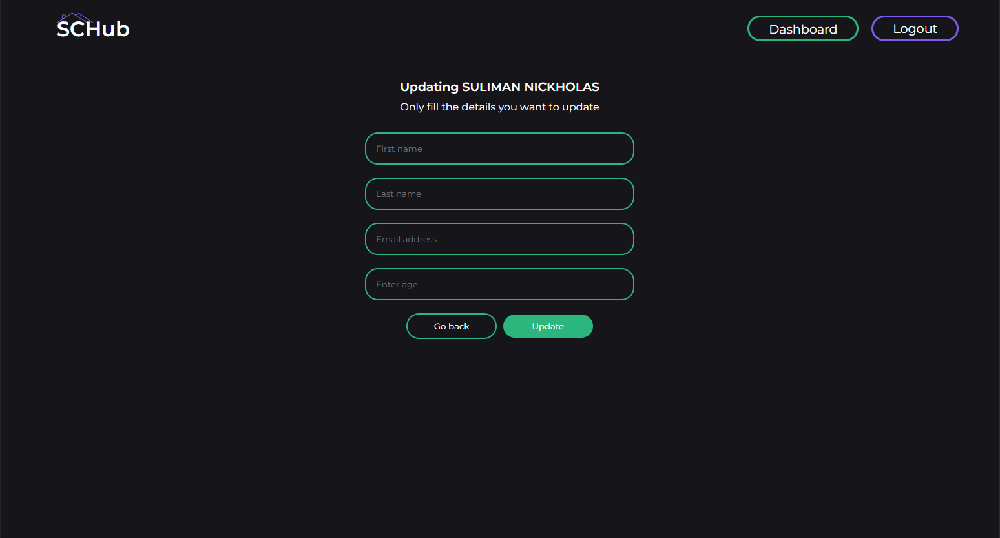
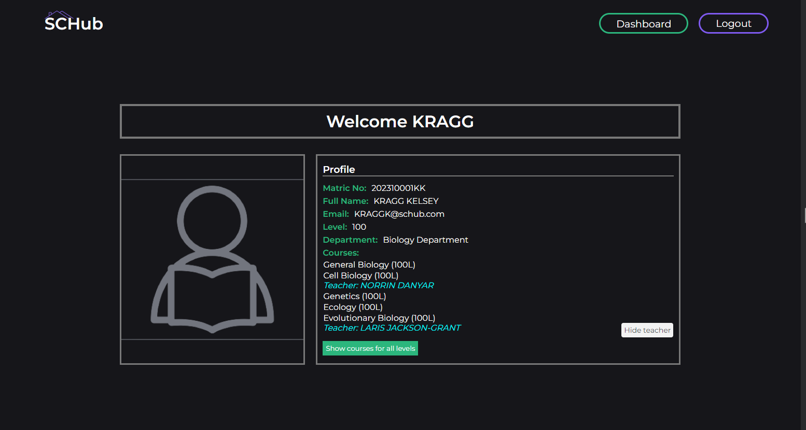
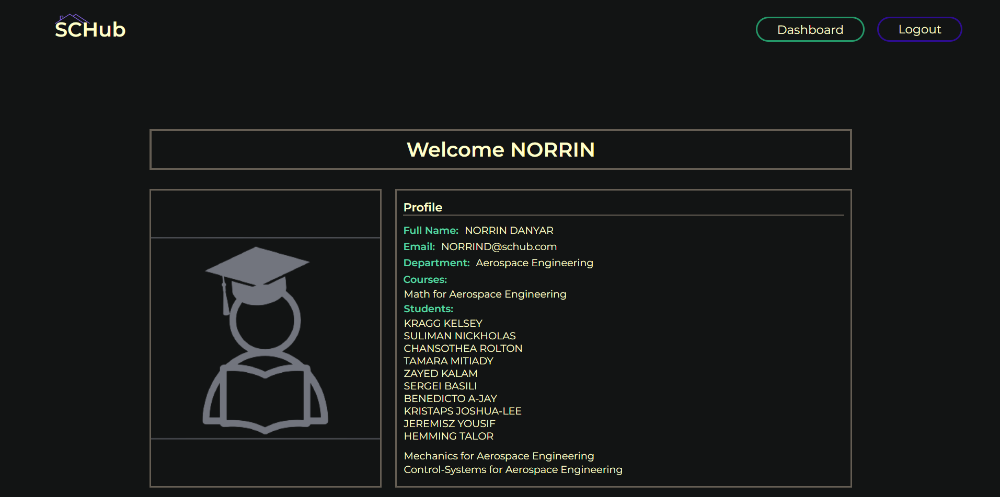

     

---

### Introduction

SCHub is a webservice that transforms the manner in which institutions, like universities and colleges, handle data storage for students, teachers, departments and courses in a secure and user-friendly setting. It incorporates technologies like MySQL, Python, ReactJS, Nginx and Haproxy to create a robust tech infrastructure for data access and management.  
Home: [SCHub](https://www.schub.me/explore)  
Article: [Blog post](https://www.schub.me/blog)  
Devs: [Aina Jesulayomi](https://www.linkedin.com/in/jesulayomi-aina-27389524a/) / [Micoliser](https://www.linkedin.com/in/samuel-iwelumo-8a43a6219/)  

## Installation

Clone the repository:

```bash
~ $ git clone https://github.com/micoliser/SCHub.git
~ $ cd SCHub
/SCHub $
```

Install Python dependencies with [pip](https://pip.pypa.io/en/stable/).

```bash
/SCHub $ pip install -r configurations/requirements.txt
```

Install react dependencies with [npm](https://www.npmjs.com/).

```bash
/SCHub $ cd schub
/schub $ npm -i
```

Run flask app and populate database with data

```bash
/SCHub $ cat data/setup_dev_db.sql | mysql -u root -p
/SCHub $ python3 -m api.app
 * Serving Flask app 'app'
 * Debug mode: off
WARNING: This is a development server. Do not use it in a production deployment. Use a production WSGI server instead.
 * Running on all addresses (0.0.0.0)
 * Running on http://127.0.0.1:5000
 * Running on http://10.0.2.15:5000
Press CTRL+C to quit
```

On another terminal . . .

```bash
/SCHub $ cd data/small
/small $ python3 -m generate_dump.py
/SCHub $ cd ../../
/SCHub $ cat data/small/dump.sql | mysql -u root -p
/SCHub $ curl http://localhost:5000/api/status
{"status": "OK"}
/SCHub $ curl http://localhost:5000/api/stats
{"admins":2,"courses":45,"departments":3,"students":30,"teachers":15}
```

## Usage

### API

GET

```bash
/SCHub $ curl localhost:5000/api/teachers/53af4926-52ee-41d0-9acc-ae7230400015
{"created_at":"2017-03-25T02:17:06","department":"Agricultural Engineering","department_id":"53af4926-52ee-41d0-9acc-ae7230300003","email":"DJUMAR@schub.com","first_name":"DJUMA","id":"53af4926-52ee-41d0-9acc-ae7230400015","last_name":"RINALDO","recovery_question":"What is the name of your childhood best friend?"}
```

DELETE

```bash
/SCHub $ curl -X DELETE http://app.schub.me/api/students/53af4926-52ee-41d0-9acc-ae7230200030 -H  accept: application/json
{}
```

PUT

```bash
/SCHub $ curl -X PUT "http://app.schub.me/api/students/53af4926-52ee-41d0-9acc-ae7230200029" -H  "Content-Type: application/json" -d '{"start_level": 200}'
{"age":28,"created_at":"2017-03-25T02:17:06","current_level":400,"department_id":"53af4926-52ee-41d0-9acc-ae7230300003","email":"JESSIE-JAMIEN@schub.com","first_name":"JESSIE-JAMIE","id":"53af4926-52ee-41d0-9acc-ae7230200029","last_name":"NHIM","matric_no":"202110029JN","recovery_question":"What is your favorite football team?","start_level":200}
```

[API Documentation](https://www.schub.me/apidocs)

### Web page


#### Admins





#### Students



#### Teachers



## Contributing

Pull requests are welcome, but please contact us first. For major changes, please open an issue first to discuss what you would like to change.  
Ensure to read the [contribution](CONTRIBUTING.md) and [conduct](CODE_OF_CONDUCT.md) pages.
Please make sure to update tests as appropriate and document changes properly.

### Contributors

|                                                                                                |                                                                                                      |
| ---------------------------------------------------------------------------------------------- | ---------------------------------------------------------------------------------------------------- |
|  |  |
| [Micoliser](https://github.com/micoliser)                                                      | [Jesulayomy](https://github.com/Jesulayomy)                                                          |

## Licensing

[GPL-3.0](https://choosealicense.com/licenses/gpl-3.0/)
